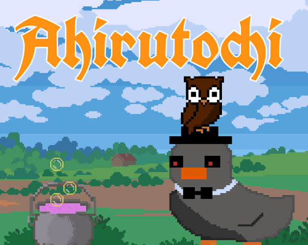

# Ahirutochi 🦆💥

A game about ducks, brewing potions and explosions.

Made in 48h for the [Global Game Jam 2025](https://globalgamejam.org/).
Play on [eddex.itch.io/ahirutochi](https://eddex.itch.io/ahirutochi)!

<a target="_blank" href="https://eddex.itch.io/ahirutochi">
</img>
</a>

## 🖼️ Assets used

- https://opengameart.org/content/transparent-bubble-soap-bubble
- https://free-game-assets.itch.io/free-summer-pixel-art-backgrounds
- https://fonts.google.com/specimen/UnifrakturCook
- https://fonts.google.com/specimen/Macondo+Swash+Caps
- https://opengameart.org/content/explosion-48px-96px-and-vector-version

## 🎵 Music used

- https://opengameart.org/content/battle-theme-a
- https://opengameart.org/content/victory-fanfare-short
- https://opengameart.org/content/medieval-the-old-tower-inn

## 🔉 Sounds used

- https://www.zapsplat.com/music/magic-trick-puff-of-smoke-vanish-disappear/
- https://www.zapsplat.com/music/drinking-glass-set-down-on-metal-table-version-2/
